# Rxiv-Maker: An Automated Template Engine for Streamlined Scientific Publications
<!-- note that this title is not rendered in the PDF, instead the one in the YAML metadata is used -->

## Abstract
Preprint servers have accelerated research dissemination, but authors now handle manuscript formatting without professional typesetting support. Rxiv-Maker converts Markdown files into publication-quality PDFs by automatically generating LaTeX code—researchers write in Markdown while the tool handles typesetting complexity. The tool creates dynamic, version-controlled documents that integrate with modern collaboration workflows. Rxiv-Maker runs Python and R scripts during compilation to generate figures, keeping visualisations synchronised with data and analyses. Automated build environments, Docker support, and built-in citation management provide reliable, reproducible builds across systems, while smart conversion logic preserves complex elements like mathematical equations. Rxiv-Maker makes professional typesetting accessible, supporting clear and open scientific publishing. This manuscript, created with Rxiv-Maker, serves as a template for future users.

## Main

<!-- Introduction -->

Scientists now rely heavily on preprint servers like arXiv, bioRxiv, and medRxiv for rapid dissemination [@beck2020;@levchenk2024;@Fraser2020_preprint_growth]. As @sfig:arxiv_growth and @sfig:preprint_trends show, this shift accelerates discovery but also moves quality control and typesetting from publishers to individual researchers [@Vale2019_preprints;@Tenant2016_academic_publishing]. Most manuscript workflows still use proprietary formats that work poorly with version control, hampering collaborative research [@lin2020]. Traditional copy-and-paste workflows between data analysis and manuscript preparation create opportunities for errors and inconsistencies, particularly when underlying data or analyses are updated [@perkel2022].

This challenge is especially common in computational research where algorithms, analytical methods, and processing pipelines evolve continuously. Fields like computational biology struggle to keep analysis methods synchronised with manuscript content, often resulting in publications that poorly reflect underlying methodologies. Bioimage analysis shows these problems clearly, where collaborative frameworks [@biaflows2024] and containerised analysis environments [@dl4miceverywhere2024] highlight the importance of reproducible computational workflows in scientific publishing.

Rxiv-Maker addresses some of these challenges through a developer-focused framework for reproducible preprint preparation. The tool specializes in producing publication-quality PDFs through automated LaTeX processing, integrating smoothly with Git workflows and continuous integration practices. Rxiv-Maker includes reproducibility safeguards typically handled by journal production teams, ensuring manuscripts remain buildable across different systems and time periods.

This approach makes manuscript preparation transparent and auditable while simplifying access to professional typesetting workflows. Rxiv-Maker includes a Visual Studio Code extension with intelligent syntax highlighting and automated citation management. The extension lets researchers use familiar development environments while maintaining version control and reproducibility standards essential for transparent science, bridging traditional authoring with modern computational research practices.

{#fig:system_diagram tex_position="t"} **The Rxiv-Maker System Diagram.** The system integrates Markdown content, YAML metadata, Python and R scripts, and bibliography files through a processing engine. This engine leverages GitHub Actions, virtual environments, and LaTeX to produce a publication-ready scientific article, demonstrating a fully automated and reproducible pipeline.

{#fig:workflow width="\textwidth" tex_position="t"} **Rxiv-Maker Workflow: User Input vs. Automated Processing.** The framework clearly separates user responsibilities (content creation and configuration) from automated processes (parsing, conversion, compilation, and output generation). Users only need to write content and set preferences. At the same time, the system handles all technical aspects of manuscript preparation automatically, ensuring a streamlined workflow from markdown input to publication-ready PDF output.

The framework enables programmatic generation of figures and tables using Python and R scripting with visualisation libraries including Matplotlib [@Hunter2007_matplotlib] and Seaborn [@Waskom2021_seaborn]. 

Figures can be generated directly from source datasets during compilation, establishing transparent connections between raw data, processing pipelines, and final visualisations. When datasets are updated or algorithms refined, affected figures are automatically regenerated, ensuring consistency and eliminating outdated visualisations. The system integrates Mermaid.js [@Mermaid2023_documentation] for generating technical diagrams from text-based syntax, with the complete range of supported methods detailed in @stable:figure-formats.

This approach reframes manuscripts as executable outputs of the research process rather than static documentation. Built upon the HenriquesLab bioRxiv template [@HenriquesLab2015_template], Rxiv-Maker extends capabilities through automated processing pipelines. The architecture, detailed in @fig:system_diagram and @fig:workflow, provides robust build automation through GitHub Actions and virtual environments, with technical details described in @snote:figure-generation. 

Rxiv-Maker fits a specific niche within the academic authoring ecosystem. All-in-one systems like Quarto offer versatility with multi-language and multi-format capabilities. Collaborative editors such as Overleaf make LaTeX accessible through web interfaces. Computational frameworks including MyST and Jupyter Book focus on interactive, web-first outputs. Modern typesetting engines like Typst provide cleaner syntax and faster compilation. Rxiv-Maker focuses on developer-centred automation for reproducible PDF preprint generation, particularly for computational workflows where dynamic figure generation and algorithmic documentation are essential. This focused approach allows deeper specialisation for manuscripts involving evolving datasets and processing pipelines. A detailed comparison is provided in @stable:tool-comparison.

<!-- Results -->

Rxiv-Maker provides an efficient workflow for producing publication-quality manuscripts that follow reproducible research principles. The tool outputs professionally typeset PDF documents—like this article, generated entirely through the automated pipeline—showing how computational content integrates with academic formatting. Markdown source files convert automatically into structured LaTeX documents, compiled to produce PDFs with proper typography, pagination, and high-resolution figures that meet publication standards.

The deployment strategy ensures computational reproducibility through Docker containerisation, packaging the complete environment—LaTeX distributions, Python libraries, R packages, and system dependencies—within container images. GitHub Actions workflows use pre-compiled Docker images for standardised compilation processes, reducing build times from 8-10 minutes to approximately 2 minutes. Docker engine mode lets researchers generate PDFs with only Docker and Python as prerequisites, useful for collaborative research across platforms or institutional settings with software restrictions [@Boettiger2015_docker_reproducibility].

PDF artefacts are automatically archived and made available, creating computational provenance from source files to final output. The system supports deployment in Google Colab notebooks for users requiring immediate feedback, maintaining reproducibility guarantees whilst offering real-time compilation. A Docker-accelerated version leverages udocker [@gomes2018] for containerized execution, reducing setup time from approximately 20 minutes to 4 minutes whilst providing pre-configured environments with all dependencies. This approach eliminates manual dependency installation and ensures consistent execution across Google Colab sessions. Available deployment strategies are compared in @stable:deployment-options.

Programmatic figure generation supports interactive environments including Jupyter notebooks [@Jupyter2016_notebook]. Python and R scripts placed within designated directories are automatically executed during compilation, loading data, performing analyses, and generating visualisations seamlessly included in the final PDF. Mermaid.js diagrams embedded within markdown are rendered into SVG images and incorporated into the document. This integration demonstrates closed-loop reproducibility, where manuscripts serve as verifiable, self-contained records of research findings.

The Visual Studio Code extension provides intelligent editing features including real-time syntax highlighting, autocompletion for bibliographic citations from BibTeX files, and seamless cross-reference management. The extension reduces cognitive load and minimises syntax errors whilst maintaining consistent formatting.

<!-- Discussion and conclusions section -->

Rxiv-Maker combines accessible plain-text writing with automated builds, making reproducible publishing more accessible to researchers. The approach follows literate programming principles [@Knuth1984_literate_programming] and executable manuscript concepts [@perkel2022], turning manuscripts into living documents that combine narrative and executable code without requiring LaTeX expertise. Integration with Git provides transparent attribution, conflict-free merging, and auditable histories of manuscript development [@Ram2013_git_science;@Perez-Riverol2016_github_bioinformatics], supporting collaborative practices essential for open science.

The rise of preprints has shifted quality control and typesetting responsibilities from journals to individual authors, creating both opportunities and challenges for scientific communication. Rxiv-Maker addresses these challenges by providing automated safeguards that help researchers produce publication-quality work without extensive typesetting expertise, making publishing tools accessible through GitHub-native infrastructure.

The focus on PDF output via LaTeX optimises preprint workflows through specialisation for scientific publishing requirements. Future development will explore extending format support through integration with universal converters such as Pandoc [@pandoc2020], while preserving typographic control and reproducibility standards. The Visual Studio Code extension reduces adoption barriers by providing familiar development environments that bridge text editing with version control workflows. Future development will focus on deeper integration with computational environments and quality assessment tools, building upon established collaborative frameworks [@biaflows2024] and containerised approaches that enhance reproducibility [@dl4miceverywhere2024]. These developments will strengthen the platform's role in collaborative manuscript preparation across computational research domains. 

The system supports scientific publishing through organised project structure separating content, configuration, and computational elements. All manuscript content, metadata, and bibliographic references are version-controlled, ensuring transparency.

The markdown-to-LaTeX conversion pipeline handles complex academic syntax including figures, tables, citations, and mathematical expressions whilst preserving semantic meaning and typographical quality. The system employs a multi-pass approach protecting literal content during transformation, ensuring intricate scientific expressions are rendered accurately. The framework supports subscript and superscript notation essential for chemical formulas, allowing expressions such as $\text{H}_2\text{O}$, $\text{CO}_2$, $\text{Ca}^{2+}$, $\text{SO}_4^{2-}$, and $E=mc^2$, as well as temperature notation like 25°C.

The system's mathematical typesetting capabilities extend to numbered equations, which are essential for scientific manuscripts. For instance, the fundamental equation relating mass and energy can be expressed as:

$$E = mc^2$${#eq:einstein}

The framework also supports more complex mathematical formulations, such as the standard deviation calculation commonly used in data analysis:

$$\sigma = \sqrt{\frac{1}{N-1} \sum_{i=1}^{N} (x_i - \bar{x})^2}$${#eq:std_dev}

Additionally, the system handles chemical equilibrium expressions, which are crucial in biochemical and chemical research:

$$K_{eq} = \frac{[\text{Products}]}{[\text{Reactants}]} = \frac{[\text{Ca}^{2+}][\text{SO}_4^{2-}]}{[\text{CaSO}_4]}$${#eq:equilibrium}

These numbered equations (@eq:einstein, @eq:std_dev, and @eq:equilibrium) demonstrate the framework's capability to handle diverse mathematical notation whilst maintaining proper cross-referencing throughout the manuscript. This functionality ensures that complex scientific concepts can be presented with the precision and clarity required for academic publication.

Rxiv-Maker is optimised for reproducible PDF preprint generation within the scientific authoring ecosystem. While platforms such as Overleaf and Quarto offer multi-format capabilities, Rxiv-Maker provides focused, developer-centred workflows that integrate with version control and automated build environments. This specialisation allows optimisation for preprint preparation requirements, ensuring manuscripts are professionally typeset and computationally reproducible.

Rxiv-Maker provides practical training in version control, automated workflows, and computational reproducibility—skills fundamental to modern scientific practice. Researchers naturally acquire technical competencies including Git proficiency, markdown authoring, continuous integration, and containerized environments. The tool is designed to be accessible without extensive programming backgrounds, featuring comprehensive documentation and intuitive workflows that reduce barriers while fostering skill development.

The technical architecture addresses computational constraints of cloud-based build systems through intelligent caching mechanisms and selective content regeneration, enabling efficient resource use. The framework supports high-resolution graphics and advanced figure layouts whilst maintaining optimal document organisation and cross-referencing functionality.

Rxiv-Maker changes how scientists prepare manuscripts, turning static documents into executable research outputs. The tool makes professional publishing technology accessible to researchers while ensuring computational reproducibility, helping them create transparent publications suitable for both immediate sharing and long-term archiving. 

This approach addresses fundamental challenges in modern computational research, where the gap between sophisticated analytical methods and traditional publishing workflows continues to widen. Rxiv-Maker bridges this divide by treating manuscripts as version-controlled software projects, enabling the same collaborative development practices that have transformed software engineering to enhance scientific communication.

Rxiv-Maker's impact extends beyond technical capabilities to foster computational literacy and transparent science. As preprint servers continue to reshape academic publishing, tools like Rxiv-Maker become essential infrastructure for maintaining quality and reproducibility in researcher-led publication processes. The tool serves as both a practical solution for immediate publishing needs and a foundation for advancing open science principles across diverse research domains.

## Methods

This section provides technical description of the Rxiv-Maker framework, demonstrating the system's capacity to generate structured documentation from source code and plain text. System architecture is detailed in @sfig:architecture.

### Processing Pipeline
Rxiv-Maker employs a sophisticated multi-stage processing pipeline orchestrated through the `rxiv` command-line interface that converts manuscript source files into publication-ready PDFs. The pipeline ensures computational reproducibility through five controlled stages:

1. **Environment Setup**: Automated dependency resolution with containerised environments using Docker or local virtual environments with pinned package versions
2. **Content Generation**: Conditional execution of Python/R scripts and Mermaid diagram compilation based on modification timestamps
3. **Markdown Processing**: Multi-pass conversion with intelligent content protection preserving mathematical expressions, code blocks, and LaTeX commands
4. **Asset Aggregation**: Systematic collection and validation of figures, tables, and bibliographic references with integrity checking
5. **LaTeX Compilation**: Optimised `pdflatex` sequences with automatic cross-reference and citation resolution

For users without local LaTeX installations, the framework provides identical build capabilities through cloud-based GitHub Actions or local CLI execution (`rxiv pdf`), democratising access to professional publishing workflows whilst maintaining reproducibility guarantees.

### Markdown-to-LaTeX Conversion
Manuscript conversion is handled by a Python processing engine managing complex academic syntax requirements through "rxiv-markdown". This multi-pass conversion system employs content protection strategies preserving computational elements such as code blocks and mathematical notation, converting specialised academic elements including dynamic citations (`@smith2023`), programmatic figures, statistical tables, and supplementary notes before applying standard markdown formatting. This approach ensures complex academic syntax is handled with precision across research domains. Supported syntax is detailed in @stable:markdown-syntax. The system supports notation essential for scientific disciplines: subscript and superscript syntax for chemical formulas such as $\text{H}_2\text{O}$ and $\text{CO}_2$, mathematical expressions including Einstein's mass-energy equivalence (@eq:einstein), chemical notation such as $\text{Ca}^{2+}$ and $\text{SO}_4^{2-}$ (@eq:equilibrium), temperature specifications like 25°C, and statistical calculations including standard deviation (@eq:std_dev). The framework supports complex mathematical expressions typical of computational workflows:

$$\frac{\partial}{\partial t} \mathbf{u} + (\mathbf{u} \cdot \nabla) \mathbf{u} = -\frac{1}{\rho} \nabla p + \nu \nabla^2 \mathbf{u}$${#eq:navier_stokes}

This approach provides accessible alternatives for common formulas whilst ensuring complex equations like the Navier-Stokes equation (@eq:navier_stokes) are rendered with professional quality. Mathematical formula support is detailed in @snote:mathematical-formulas. 

### Programmatic Content and Environments
The framework provides programmatic content generation treating figures, statistical analyses, and algorithmic diagrams as reproducible computational outputs linked to source data and processing pipelines. The build pipeline executes scripting environments including Python, R, and Mermaid, employing intelligent caching mechanisms to avoid redundant computation whilst maintaining traceability between datasets, algorithms, and visualisations (@snote:figure-generation). Rxiv-Maker implements multi-layered environment management addressing complex dependency requirements. Dependencies are rigorously pinned, isolated virtual environments support development workflows, and containerised environments ensure consistent execution across computing platforms. Cloud-based GitHub Actions provide controlled, auditable build environments guaranteeing identical computational outcomes across systems.

### Deployment Architecture and Platform Considerations
The framework provides flexible deployment strategies for diverse research environments. Local installation offers optimal performance and universal architecture compatibility, supporting AMD64 and ARM64 systems with direct access to native resources required for diagram generation. This approach enables faster iteration cycles and comprehensive debugging capabilities.

Containerised execution through Docker Engine Mode eliminates local dependency management by providing pre-configured environments containing LaTeX distributions, Python libraries, R packages, and Node.js tooling. Due to Google Chrome limitations for ARM64 Linux distributions, Docker deployment uses AMD64 base images running via Rosetta emulation on Apple Silicon systems. For optimal performance on ARM64 systems, local installation provides full capabilities without emulation overhead.

Cloud-based deployment through GitHub Actions provides architecture-agnostic automated builds for continuous integration workflows. The modular architecture enables researchers to select deployment strategies appropriate to technical constraints whilst maintaining reproducibility guarantees.

### Visual Studio Code Extension
Rxiv-Maker includes a Visual Studio Code extension providing an integrated development environment for collaborative manuscript preparation. The extension leverages the Language Server Protocol delivering real-time syntax highlighting for academic markdown syntax, intelligent autocompletion for bibliographic citations from BibTeX files, and context-aware suggestions for cross-references to figures, tables, equations, and supplementary materials. The extension integrates with the main framework through file system monitoring and automated workspace detection, recognising rxiv-maker project structures and providing appropriate editing features. Schema validation for YAML configuration files ensures project metadata adheres to reproducibility specifications, whilst integrated terminal access enables direct execution of framework commands. This provides researchers with accessible, feature-rich editing experience maintaining reproducibility guarantees whilst reducing technical barriers.

## Data availability
The arXiv monthly submission data is available at [https://arxiv.org/stats/monthly_submissions](https://arxiv.org/stats/monthly_submissions). Preprint submission data is available at [https://github.com/esperr/pubmed-by-year](https://github.com/esperr/pubmed-by-year). The source code and data for figures are available at [https://github.com/HenriquesLab/rxiv-maker](https://github.com/HenriquesLab/rxiv-maker).

## Code availability
The Rxiv-Maker framework is available at [https://github.com/HenriquesLab/rxiv-maker](https://github.com/HenriquesLab/rxiv-maker), which includes documentation, examples, and automated tests. The Visual Studio Code extension is available at [https://github.com/HenriquesLab/vscode-rxiv-maker](https://github.com/HenriquesLab/vscode-rxiv-maker). All source code is under an MIT License.

## Author contributions
Both Bruno M. Saraiva, Guillaume Jacquemet, and Ricardo Henriques conceived the project and designed the framework. All authors contributed to writing and reviewing the manuscript.

## Acknowledgements
We thank Jeffrey M. Perkel for valuable suggestions. B.S. and R.H. acknowledge support from the European Research Council (ERC) under the European Union's Horizon 2020 research and innovation programme (grant agreement No. 101001332) (to R.H.) and funding from the European Union through the Horizon Europe program (AI4LIFE project with grant agreement 101057970-AI4LIFE and RT-SuperES project with grant agreement 101099654-RTSuperES to R.H.). Funded by the European Union. However, the views and opinions expressed are those of the authors only and do not necessarily reflect those of the European Union. Neither the European Union nor the granting authority can be held responsible for them. This work was also supported by a European Molecular Biology Organization (EMBO) installation grant (EMBO-2020-IG-4734 to R.H.), a Chan Zuckerberg Initiative Visual Proteomics Grant (vpi-0000000044 with https://doi.org/10.37921/743590vtudfp to R.H.), and a Chan Zuckerberg Initiative Essential Open Source Software for Science (EOSS6-0000000260). This study was supported by the Academy of Finland (no. 338537 to G.J.), the Sigrid Juselius Foundation (to G.J.), the Cancer Society of Finland (Syöpäjärjestöt, to G.J.), and the Solutions for Health strategic funding to Åbo Akademi University (to G.J.). This research was supported by the InFLAMES Flagship Program of the Academy of Finland (decision no. 337531).
