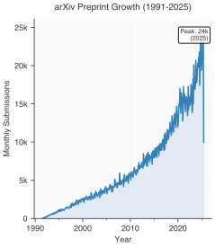
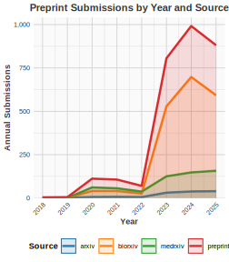

## Supplementary Tables

| **Format** | **Input Extension** | **Processing Method** | **Output Formats** | **Quality** | **Use Case** |
|---------|-----------------|------------------|----------------|---------|----------|
| **Mermaid Diagrams** | `.mmd` | Mermaid CLI | SVG, PNG, PDF | Vector/Raster | Flowcharts, architectures |
| **Python and R Figures** | `.py`, `.R` | Script execution | PNG, PDF, SVG | Publication | Data visualisation |
| **Static Images** | `.png`, `.jpg`, `.svg` | Direct inclusion | Same format | Original | Photographs, logos |
| **LaTeX Graphics** | `.tex`, `.tikz` | LaTeX compilation | PDF | Vector | Mathematical diagrams |
| **Data Files** | `.csv`, `.json`, `.xlsx` | Python and R processing | Via scripts | Computed | Raw data integration |

{#stable:figure-formats} **Supported Figure Generation Methods.** Figure processing methods supported by Rxiv-Maker, showing input formats, processing approaches, and output options for both static images and computed graphics.

| **Tool** | **Type** | **Markdown** | **Primary Use Case** | **Key Strengths** | **Open Source** |
|----------|----------|--------------|-------------------|-------------------|-----------------|
| **Rxiv-Maker** | Pipeline | Excellent | Preprint servers | GitHub Actions integration, automated workflows | Yes |
| **Overleaf** [@Overleaf2024] | Web Editor | Limited | Academic publishing | Real-time collaboration, rich templates | Freemium |
| **Quarto** [@Quarto2024] | Publisher | Native | Multi-format publishing | Polyglot support, multiple outputs | Yes |
| **Pandoc** [@pandoc2020] | Converter | Excellent | Format conversion | Universal format support, extensible | Yes |
| **Typst** [@Typst2024] | Typesetter | Good | Modern typesetting | Fast compilation, modern syntax | Yes |
| **Bookdown** [@Xie2016_bookdown] | Publisher | R Markdown | Academic books | Cross-references, multiple formats | Yes |
| **Direct LaTeX** | Typesetter | Limited | Traditional publishing | Ultimate control, established workflows | Yes |

{#stable:tool-comparison} **Comparison of Manuscript Preparation Tools.** Comparison of manuscript preparation tools, showing how Rxiv-Maker fits within the existing ecosystem of academic publishing software. Each tool serves different needs: Overleaf for collaborative LaTeX editing, Quarto for multi-format publishing, and Rxiv-Maker for streamlined preprint preparation. Different tools excel in distinct contexts: Overleaf dominates collaborative LaTeX editing, Quarto excels at multi-format computational publishing, and Rxiv-Maker streamlines the workflow of preparing reproducible preprints for submission to arXiv, bioRxiv, and medRxiv.

| **Deployment Method** | **Environment** | **Dependencies** | **Collaboration** | **Ease of Use** | **Reproducibility** |
|-------------------|-------------|-------------|--------------|-------------|----------------|
| **GitHub Actions** | Cloud CI/CD | None (cloud) | Automatic | Very High | Perfect |
| **Google Colab** | Web browser | None (cloud) | Shared notebooks | Very High | High |
| **Local Python** | Local machine | Python + LaTeX | Git-based | Medium | Good |
| **Manual LaTeX** | Local machine | Full LaTeX suite | Git-based | Low | Variable |

{#stable:deployment-options} **Rxiv-Maker Deployment Strategies.** Comparison of available compilation methods, showing how the framework accommodates different user preferences and technical environments while maintaining consistent output quality.

| **Markdown Element** | **LaTeX Equivalent** | **Description** |
|------------------|------------------|-------------|
| *Basic Text Formatting* | | |
| `**bold text**` | `\textbf{bold text}` | Bold formatting for emphasis |
| `*italic text*` | `\textit{italic text}` | Italic formatting for emphasis |
| `~subscript~` | `\textsubscript{subscript}` | Subscript formatting (H~2~O, CO~2~) |
| `^superscript^` | `\textsuperscript{superscript}` | Superscript formatting (E=mc^2^, x^n^) |
| *Document Structure* | | |
| `# Header 1` | `\section{Header 1}` | Top-level section heading |
| `## Header 2` | `\subsection{Header 2}` | Second-level section heading |
| `### Header 3` | `\subsubsection{Header 3}` | Third-level section heading |
| *Lists* | | |
| `- list item` | `\begin{itemize}\item...\end{itemize}` | Unordered list |
| `1. list item` | `\begin{enumerate}\item...\end{enumerate}` | Ordered list |
| *Links and URLs* | | |
| `[link text](url)` | `\href{url}{link text}` | Hyperlink with custom text |
| `https://example.com` | `\url{https://example.com}` | Bare URL |
| *Citations* | | |
| `@citation` | `\cite{citation}` | Single citation reference |
| `[@cite1;@cite2]` | `\cite{cite1,cite2}` | Multiple citation references |
| **Cross-References** | | |
| `@fig:label` | `\ref{fig:label}` | Figure cross-reference |
| `@sfig:label` | `\ref{sfig:label}` | Supplementary figure cross-reference |
| `@table:label` | `\ref{table:label}` | Table cross-reference |
| `@stable:label` | `\ref{stable:label}` | Supplementary table cross-reference |
| `@eq:label` | `\eqref{eq:label}` | Equation cross-reference |
| `@snote:label` | `\sidenote{label}` | Supplement note cross-reference |
| *Tables and Figures* | | |
| Markdown table | `\begin{table}...\end{table}` | Table with automatic formatting |
| Image with caption | `\begin{figure}...\end{figure}` | Figure with separate caption |
| *Document Control* | | |
| `<!-- comment -->` | `% comment` | Comments (converted to LaTeX style) |
| `<newpage>` | `\newpage` | Manual page break control |
| `<clearpage>` | `\clearpage` | Page break with float clearing |

{#stable:markdown-syntax} **Rxiv-Maker Markdown Syntax Overview.** Mapping of markdown elements to their LaTeX equivalents, showing the automated translation system that lets researchers write in familiar markdown syntax while producing professional LaTeX output.

<newpage>

## Supplementary Notes

{#snote:figure-generation} **Programmatic Figure Generation**

Rxiv-Maker generates figures through two methods: Mermaid diagrams and Python/R scripts. Both keep figures connected to their source data.

Mermaid diagrams start as text files that describe flowcharts or system diagrams. During compilation, the Mermaid CLI converts these to SVG, PNG, or PDF files. Since the diagrams are text-based, they work with version control and update automatically when the source changes.

Python and R scripts run during document compilation to create figures from data files. This means figures update when data changes, preventing outdated graphics. The system finds the generated image files and includes them in the final document. Scripts can access the same data files used in the analysis, keeping visualisations current with the research.

{#snote:mathematical-formulas} **Mathematical Formula Support and LaTeX Integration**

Rxiv-Maker converts markdown math expressions to LaTeX format. Users can write math in familiar markdown syntax and get proper LaTeX typesetting in the final document.

Inline mathematical expressions use dollar sign delimiters (`$...$`), enabling formulas such as $E = mc^2$ or $\alpha = \frac{\beta}{\gamma}$ to be embedded within text. The conversion system preserves expressions during markdown-to-LaTeX transformation, ensuring mathematical notation maintains proper formatting and spacing.

Display equations utilise double dollar delimiters (`$$...$$`) for prominent mathematical expressions requiring centred presentation. Complex equations such as the Schrödinger equation:

$$i\hbar\frac{\partial}{\partial t}\Psi(\mathbf{r},t) = \hat{H}\Psi(\mathbf{r},t)$$

or the Navier-Stokes equations:

$$\rho\left(\frac{\partial \mathbf{v}}{\partial t} + \mathbf{v} \cdot \nabla \mathbf{v}\right) = -\nabla p + \mu \nabla^2 \mathbf{v} + \mathbf{f}$$

demonstrate the framework's capability to handle sophisticated mathematical typography, including Greek letters, partial derivatives, vector notation, and complex fraction structures.

The system supports LaTeX's mathematical environments by directly including LaTeX code blocks. This hybrid approach enables simple markdown syntax for straightforward expressions whilst retaining access to LaTeX's full capabilities for complex multi-line derivations.

Mathematical expressions within figure captions, table entries, and cross-references are automatically processed, ensuring consistent typography throughout documents. The framework's content protection system preserves mathematical expressions during multi-stage conversion, preventing unwanted modifications.

Statistical notation commonly required in manuscripts is supported, including confidence intervals $\mu \pm \sigma$, probability distributions $P(X \leq x)$, and significance levels $p < 0.05$. Complex expressions involving summations $\sum_{i=1}^{n} x_i$, integrals $\int_{-\infty}^{\infty} f(x) dx$, and matrix operations $\mathbf{A}^{-1}\mathbf{b} = \mathbf{x}$ are rendered with appropriate spacing.

<newpage>

## Supplementary Figures 

{#sfig:arxiv_growth width="100%"} **The growth of preprint submissions on the arXiv server from 1991 to 2025.** Data from arXiv public statistics, plotted using a Python script that runs during document compilation.

{#sfig:preprint_trends width="100%"} **Preprint Submission Trends Across Multiple Servers (2018-2025).** The figure displays the annual number of preprint submissions to major repositories, including arXiv, bioRxiv, and medRxiv. Data from publicly available sources [@PubMedByYear2025], visualised using an R script that executes during compilation to ensure current data.

{#sfig:architecture width="75%"} **Detailed System Architecture and Processing Layers.** Technical diagram showing the complete Rxiv-Maker architecture, including input layer organisation, processing engine components (parsers, converters, generators), compilation infrastructure, output generation, and deployment methodology with Docker containerisation support. This figure shows the modular design that enables independent development and testing of system components across both local and containerised environments.

