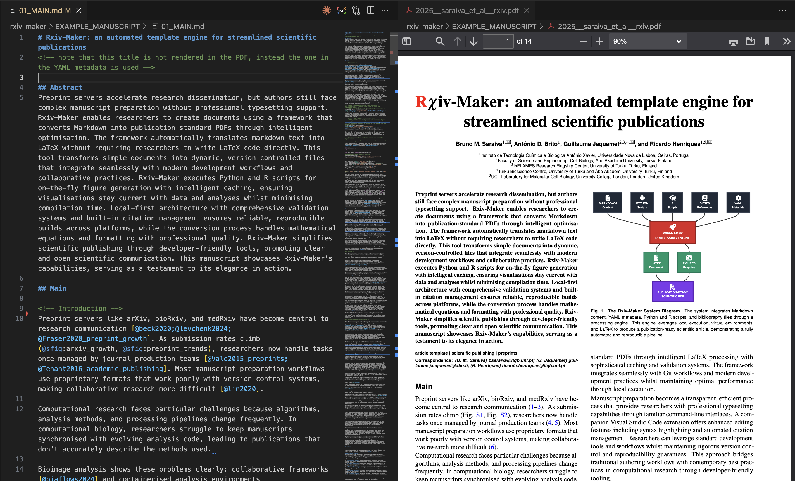

[](https://doi.org/10.48550/arXiv.2508.00836)
[](https://github.com/henriqueslab/vscode-rxiv-maker/blob/main/LICENSE)
[](https://github.com/henriqueslab/vscode-rxiv-maker/graphs/contributors)
[](https://github.com/HenriquesLab/vscode-rxiv-maker/stargazers)
[](https://github.com/henriqueslab/vscode-rxiv-maker/forks)


# Rxiv-Maker VS Code Extension

> 🔗 **Companion extension for [Rxiv-Maker](https://github.com/HenriquesLab/rxiv-maker)** - The automated LaTeX article generation system

A VS Code extension that brings the power of [Rxiv-Maker](https://github.com/HenriquesLab/rxiv-maker) directly into your editor. Transform scientific manuscript writing with enhanced markdown features, intelligent autocompletion, and seamless integration with the rxiv-maker workflow.

This extension provides syntax highlighting, IntelliSense, and project management tools for **rxiv-markdown** - the enhanced markdown syntax that bridges the gap between easy writing and professional LaTeX output.

## About Rxiv-Maker

[Rxiv-Maker](https://github.com/HenriquesLab/rxiv-maker) is an automated LaTeX article generation system that transforms scientific writing from chaos to clarity. It converts Markdown manuscripts into publication-ready PDFs with reproducible figures, professional typesetting, and zero LaTeX hassle.

The platform bridges the gap between **easy writing** (Markdown) and **beautiful output** (LaTeX), featuring automated figure generation from Python/R scripts and Mermaid diagrams, seamless citation management, and integration with GitHub Actions for cloud-based PDF generation.

## VS Code Extension Features

- **🎨 Syntax Highlighting**: Custom syntax highlighting for rxiv-maker markdown files (.rxm)
- **🐍 Python Code Execution**: Full syntax highlighting for embedded Python code blocks and expressions
- **📝 Blindtext Support**: Intelligent support for LaTeX blindtext placeholder commands
- **💡 Citation Completion**: IntelliSense for bibliography entries from `03_REFERENCES.bib`
- **🔗 Cross-reference Completion**: Autocompletion for `@fig:`, `@table:`, `@eq:`, `@snote:` references
- **✅ YAML Validation**: Schema validation for `00_CONFIG.yml` configuration files
- **⚡ Smart Commands**: Insert Python blocks, blindtext, citations, and references with intelligent templates
- **🏗️ Integrated Workflow**: Direct access to rxiv-maker build, validate, and clean commands
- **🔄 Smart Update Management**: Auto-detects rxiv-maker installation method (Homebrew, pipx, uv, pip) and shows appropriate upgrade commands
- **📊 Status Bar Integration**: Shows rxiv-maker Python package version and update availability at a glance

### 🎨 Syntax Highlighting Demo



*Enhanced syntax highlighting demonstrates the extension's comprehensive support for scientific writing features including Python code blocks, mathematical notation, cross-references, citations, and LaTeX injection.*

See [`example-syntax-showcase.rxm`](example-syntax-showcase.rxm) for a comprehensive demonstration of all syntax highlighting features. This file showcases:

- **Text formatting**: Bold, italic, subscript, superscript
- **Scientific notation**: Chemical formulas, mathematical expressions
- **Cross-references**: Figures, tables, equations, supplementary materials
- **Citations**: Multiple citation formats and bibliography integration
- **Python code blocks**: Executable code with full syntax highlighting
- **LaTeX injection**: Direct LaTeX commands and mathematical notation
- **Advanced features**: Blindtext, comments, document control commands

*Perfect for taking screenshots and demonstrating the extension's capabilities!*

## Key Benefits for VS Code Users

- **Enhanced Productivity**: Write manuscripts with intelligent autocompletion and syntax highlighting
- **Error Prevention**: Real-time validation catches configuration errors and missing references
- **Seamless Integration**: Access all rxiv-maker features directly from VS Code
- **Professional Writing**: Focus on content while the extension handles formatting and references
- **Team Collaboration**: Consistent experience across team members using VS Code

## Supported Rxiv-Markdown Syntax

<details>
<summary><strong>📋 Complete Rxiv-Markdown Feature List</strong></summary>

| **Markdown Element** | **LaTeX Equivalent** | **Description** |
|------------------|------------------|-------------|
| **Basic Text Formatting** | | |
| `**bold text**` | `\textbf{bold text}` | Bold formatting for emphasis |
| `*italic text*` | `\textit{italic text}` | Italic formatting for emphasis |
| `~subscript~` | `\textsubscript{subscript}` | Subscript formatting (H~2~O, CO~2~) |
| `^superscript^` | `\textsuperscript{superscript}` | Superscript formatting (E=mc^2^, x^n^) |
| **Document Structure** | | |
| `# Header 1` | `\section{Header 1}` | Top-level section heading |
| `## Header 2` | `\subsection{Header 2}` | Second-level section heading |
| `### Header 3` | `\subsubsection{Header 3}` | Third-level section heading |
| **Lists** | | |
| `- list item` | `\begin{itemize}\item...\end{itemize}` | Unordered list |
| `1. list item` | `\begin{enumerate}\item...\end{enumerate}` | Ordered list |
| **Links and URLs** | | |
| `[link text](url)` | `\href{url}{link text}` | Hyperlink with custom text |
| `https://example.com` | `\url{https://example.com}` | Bare URL |
| **Citations** | | |
| `@citation` | `\cite{citation}` | Single citation reference |
| `[@cite1;@cite2]` | `\cite{cite1,cite2}` | Multiple citation references |
| **Cross-References** | | |
| `@fig:label` | `\ref{fig:label}` | Figure cross-reference |
| `@sfig:label` | `\ref{sfig:label}` | Supplementary figure cross-reference |
| `@table:label` | `\ref{table:label}` | Table cross-reference |
| `@stable:label` | `\ref{stable:label}` | Supplementary table cross-reference |
| `@eq:label` | `\eqref{eq:label}` | Equation cross-reference |
| `@snote:label` | `\ref{snote:label}` | Supplement note cross-reference |
| **Tables and Figures** | | |
| Markdown table | `\begin{table}...\end{table}` | Table with automatic formatting |
| Image with caption | `\begin{figure}...\end{figure}` | Figure with separate caption |
| **Document Control** | | |
| `<!-- comment -->` | `% comment` | Comments (converted to LaTeX style) |
| `<newpage>` | `\newpage` | Manual page break control |
| `<clearpage>` | `\clearpage` | Page break with float clearing |
| **Custom Commands** | | |
| `{{blindtext}}` | `\blindtext` | Short placeholder text for document testing |
| `{{Blindtext}}` | `\Blindtext` | Paragraph placeholder text for document testing |
| `{{py: code}}` | Executed Python code | Multi-line Python code execution with output |
| `{py: expression}` | Executed expression | Inline Python expression evaluation |

</details>

## Installation

1. Install from VS Code Marketplace: Search for "Rxiv-Maker"
2. Or install from VSIX: Download the latest release and install manually

## Usage

1. **Open a workspace** containing rxiv-maker files
2. **Create or open** `.rxm` files, `01_MAIN.md`, or `02_SUPPLEMENTARY_INFO.md`
3. **Use Ctrl+Space** for autocompletion of citations and references
4. **Access commands** via Command Palette (`Ctrl+Shift+P`)

### File Recognition

The extension automatically activates when it detects:
- Files with `.rxm` extension
- `01_MAIN.md` (main manuscript)
- `02_SUPPLEMENTARY_INFO.md` (supplementary information)
- `00_CONFIG.yml` (configuration file)

### Advanced Features

- **Figure metadata**: `{#fig:label width="50%" tex_position="t"}`
- **Math expressions**: `$inline$`, `$$block$$`, `$$equation$$ {#eq:label}`
- **Scientific notation**: `~subscript~`, `^superscript^`
- **Document control**: `<newpage>`, `<clearpage>`

## Available Commands

Access these commands through the Command Palette (`Ctrl+Shift+P`):

### Content Insertion
- **`Rxiv-Maker: Insert Citation`** - Insert bibliography citation
- **`Rxiv-Maker: Insert Figure Reference`** - Insert figure reference
- **`Rxiv-Maker: Insert Table Reference`** - Insert table reference  
- **`Rxiv-Maker: Insert Equation Reference`** - Insert equation reference
- **`Rxiv-Maker: Insert blindtext placeholder`** - Insert short placeholder text
- **`Rxiv-Maker: Insert blindtext paragraph`** - Insert paragraph placeholder text
- **`Rxiv-Maker: Insert Python code block`** - Insert `{{py: code}}` template with syntax highlighting
- **`Rxiv-Maker: Insert inline Python expression`** - Insert `{py: expression}` template

### Project Management
- **`Rxiv-Maker: Add Bibliography Entry by DOI`** - Add new bibliography entry
- **`Rxiv-Maker: Validate`** - Check project structure and files
- **`Rxiv-Maker: Build PDF`** - Generate PDF from manuscript
- **`Rxiv-Maker: Clean`** - Clean build artifacts
- **`Rxiv-Maker: Install rxiv-maker framework`** - Automated installation with dependency checking
- **`Rxiv-Maker: Upgrade rxiv-maker`** - Upgrade rxiv-maker Python package to latest version (auto-detects install method)
- **`Rxiv-Maker: Show rxiv-maker Status`** - Display rxiv-maker version and installation details

## Project Structure

This extension works with the standard rxiv-maker project structure:

```
your-manuscript/
├── 00_CONFIG.yml           # Project configuration (validated)
├── 01_MAIN.md             # Main manuscript (syntax highlighted)
├── 02_SUPPLEMENTARY_INFO.md # Supplementary information (optional)
├── 03_REFERENCES.bib      # Bibliography (autocompletion source)
├── FIGURES/               # Figure generation scripts
│   ├── fig_01.py         # Python figure script
│   ├── fig_02.R          # R figure script
│   └── fig_03.mmd        # Mermaid diagram
└── output/                # Generated PDFs and artifacts
```

## Requirements

- **VS Code**: Version 1.101.0 or higher
- **Rxiv-Maker**: Install the main [rxiv-maker](https://github.com/HenriquesLab/rxiv-maker) system for full functionality
- **Project Files**: Standard rxiv-maker project structure

For full manuscript generation capabilities, see the [Rxiv-Maker documentation](https://github.com/HenriquesLab/rxiv-maker/blob/main/docs/user_guide.md).

## Configuration

The extension can be configured through VS Code settings (`Ctrl+,` or `Cmd+,`):

- **`rxiv-maker.showStatusBarButton`** (boolean, default: `true`): Show PDF build button in status bar
- **`rxiv-maker.checkForUpdates`** (boolean, default: `true`): Check for rxiv-maker Python package updates automatically
- **`rxiv-maker.updateCheckInterval`** (number, default: `24`): Hours between update checks

The extension automatically detects how rxiv-maker is installed (Homebrew, pipx, uv, pip, etc.) and shows the appropriate upgrade command when updates are available.

## Getting Started with Rxiv-Maker

### 🌐 Documentation Hub
**[📖 Website Documentation](https://rxiv-maker.henriqueslab.org/)** - Start here for complete tutorials and guides

### Quick Setup Options

| Setup Type | Best For | Requirements | Time |
|-----------|----------|--------------|------|
| **[Website Tutorial](https://rxiv-maker.henriqueslab.org/getting-started/installation/)** | New users | Basic setup | 5-10 min |
| **[Google Colab](https://colab.research.google.com/github/HenriquesLab/rxiv-maker/blob/main/notebooks/rxiv_maker_colab.ipynb)** | No installation | Google account | 2 min |
| **[GitHub Actions](https://github.com/HenriquesLab/rxiv-maker/blob/main/docs/github-actions-guide.md)** | Team collaboration | GitHub account | 5 min |
| **[Docker Setup](https://github.com/HenriquesLab/docker-rxiv-maker)** | Containerized | Docker installed | 5 min |

### 🚀 Essential Links
- **[First Manuscript Tutorial](https://rxiv-maker.henriqueslab.org/getting-started/first-manuscript/)** - 5-minute walkthrough
- **[User Guide](https://rxiv-maker.henriqueslab.org/guides/)** - Complete documentation
- **[VS Code Features](https://marketplace.visualstudio.com/items?itemName=henriqueslab.rxiv-maker)** - This extension

## How to Cite

<a href="https://arxiv.org/abs/2508.00836"></a>

If you use Rxiv-Maker or this VS Code extension in your research, please cite our work:

**BibTeX:**
```bibtex
@misc{saraiva2025rxivmakerautomatedtemplateengine,
      title={Rxiv-Maker: An Automated Template Engine for Streamlined Scientific Publications}, 
      author={Bruno M. Saraiva and António D. Brito and Guillaume Jaquemet and Ricardo Henriques},
      year={2025},
      eprint={2508.00836},
      archivePrefix={arXiv},
      primaryClass={cs.DL},
      url={https://arxiv.org/abs/2508.00836}, 
}
```

**APA Style:**
Saraiva, B. M., Jacquemet, G., & Henriques, R. (2025). Rxiv-Maker: an automated template engine for streamlined scientific publications. *Arxiv*. 
https://doi.org/10.48550/arXiv.2508.00836

## Related Projects

- **[Rxiv-Maker](https://github.com/HenriquesLab/rxiv-maker)** - Main automated LaTeX article generation system
- **[Rxiv-Maker Documentation](https://github.com/HenriquesLab/rxiv-maker/blob/main/docs/user_guide.md)** - Complete usage guide
- **[GitHub Actions Guide](https://github.com/HenriquesLab/rxiv-maker/blob/main/docs/github-actions-guide.md)** - Cloud-based PDF generation

## Contributing

We welcome contributions to both the extension and the main rxiv-maker project! 

- **Extension Issues**: [Report here](https://github.com/HenriquesLab/vscode-rxiv-maker/issues)
- **Main Project**: [Contributing Guide](https://github.com/HenriquesLab/rxiv-maker/blob/main/CONTRIBUTING.md)

## License

MIT License - see [LICENSE](LICENSE) for details. Use it, modify it, share it freely.

---

**© 2025 Jacquemet and Henriques Labs | Rxiv-Maker**  
*"Because science is hard enough without fighting with LaTeX."*